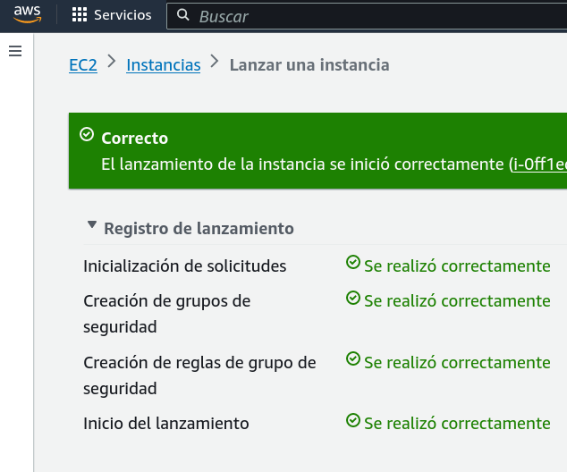
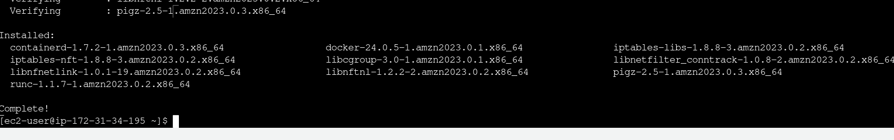
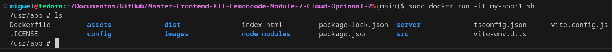
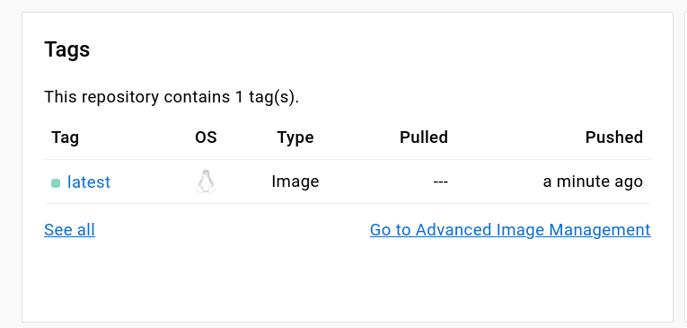
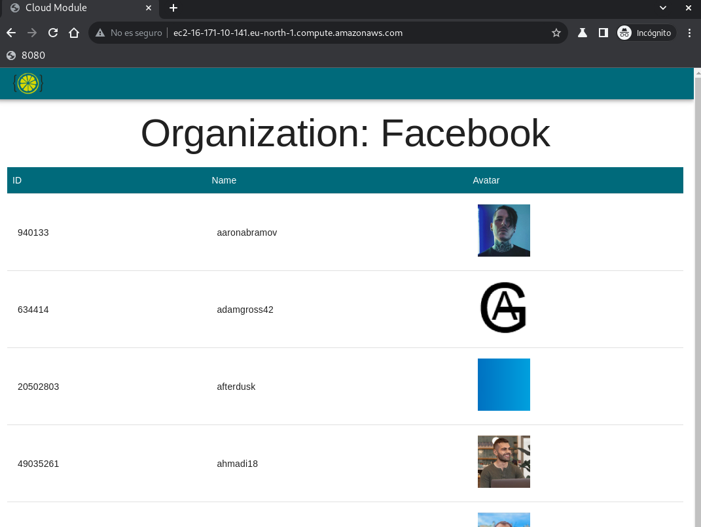

# Master-Frontend-XII-Lemoncode-Module-7-Cloud-Opcional-4

# Master Frontend XII Lemoncode 🍋

## Module 7 CLOUD

### opcional parte 4

 

[Go back - Index](https://github.com/MiguelJiRo/Master-Frontend-XII-Lemoncode)

 

 

### Parte opcional - 4

<ol>
    <li>✅ Desplegar aplicación front con Docker y AWS.</li>
</ol>

Para el desarrollo de esta parte se ha partido del ejemplo de: https://github.com/Lemoncode/master-frontend-lemoncode/tree/master/07-cloud/03-docker/06-aws-deploy

 

sudo yum update -y

 

sudo yum install -y docker

 

 

creamos una imagen de docker de nuestro repositorio:

 

se importa la imagen de docker de docker hub con el comando
 
sudo docker run --rm -d -p 80:8000 &&&&&&/my-app
 

 

### Resultado

 

#### URL:

http://ec2-16-171-10-141.eu-north-1.compute.amazonaws.com/
